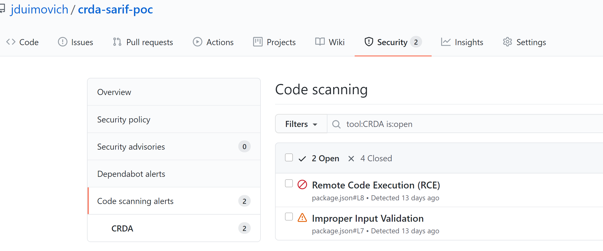

# Code Ready Dependency Analytics CLI with conversion to Sarif Action

[](https://github.com/jduimovich/crda-sarif-poc/actions/workflows/ci.yml)

This Action uses the [CRDA CLI](https://github.com/fabric8-analytics/cli-tools/blob/main/docs/cli_README.md) to scan a file for dependency vulnerabilities and upload to the Github Security Scanning Facility.

The CRDA CLI produces a json format which contains a detailed list of any dependencies with vulnerabilties. In order to use this with the GitHub security scan support, a converter creates a Sarif file for uploaded using `github/codeql-action/upload-sarif@v1`. To learn more see [https://docs.github.com/en/code-security/secure-coding/sarif-support-for-code-scanning](https://docs.github.com/en/code-security/secure-coding/sarif-support-for-code-scanning).



The status of this action is PoC. 

Sample usage is below. In order to get a full scan, a SNYK_TOKEN is required to use this action.

The output file defaults to `output.sarif` but can be changed by the user. 

``` 
name: CI
on: [push]  
jobs:
  test:
    runs-on: ubuntu-latest
    name: Run CRDA and Convert to Sarif
    steps: 
      - name: Checkout
        uses: actions/checkout@v2 
      - name: Run CRDA and Convert to Sarif
        uses: jduimovich/crda-sarif-poc@main 
        with:
          input-file-name: package.json
          snyk-token: ${{ secrets.SNYK_TOKEN }}
          output-file-name: output.sarif
      - name: CRDA Sarif View
        run: |  
          cat output.sarif  | jq 
      - name: Upload result to GitHub Code Scanning
        uses: github/codeql-action/upload-sarif@v1
        with:
          sarif_file: output.sarif 
```
